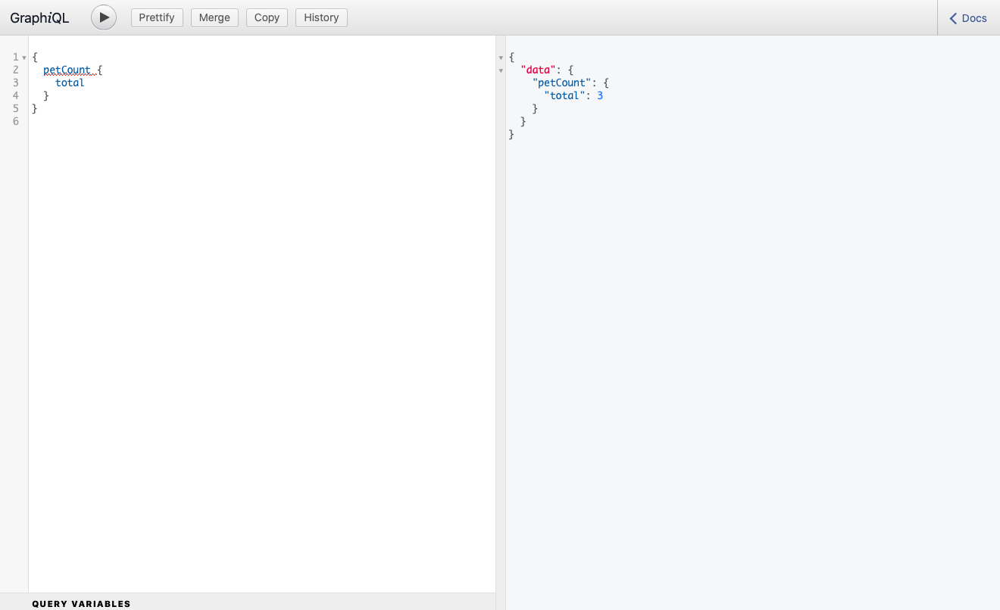

# How to use

## Prerequisites
- GIT installed
- NPM installed

## Steps
1. Navigate to and/or create the directory where you want to install the app.
2. In terminal/shell, enter: `git clone git@github.com:MackRoe/GettingStarted-GraphQL.git`

3. Then, still in terminal, do: `npm install` to install the needed node modules.
4. To run the app, enter: `npm start` and navigate to `localhost:4000` in your browser.

## The UI

Queries are added on the left and the data returned appears on the right. To send a query, click the run [>] button.

## The Queries

- [x] *functional*

`{
  allPets {
    name
  }
}`

`{
  getPet(index: 0) {
    name
  }
}`

`{
  getTime {
    hour
    second
    minute
  }
}`

`{
  getRandom(range: 100)
}`

`{
  petCount {
    total
  }
}`

`{
  petsInRange(start: 0, count: 2) {
    name
  }
}`

`{
  # species can be "Cat" or "Dog"
  getPetBySpecies(species: "Cat") {
    name
  }
}`

<!-- - [ ] *not functional*
`{
  allSpecies {
    name
  }
}` -->
